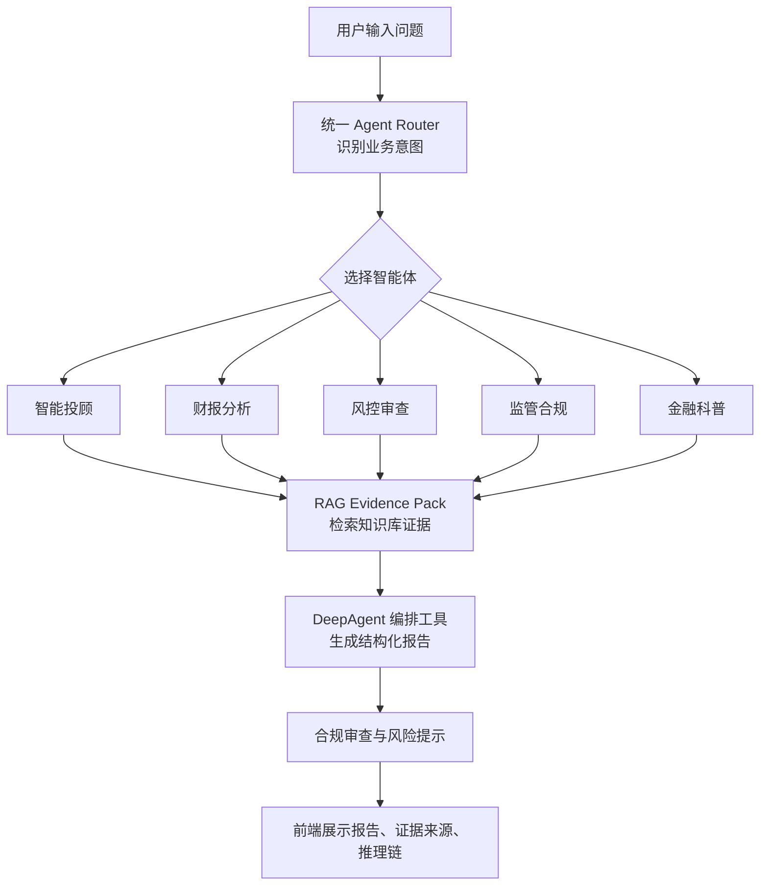
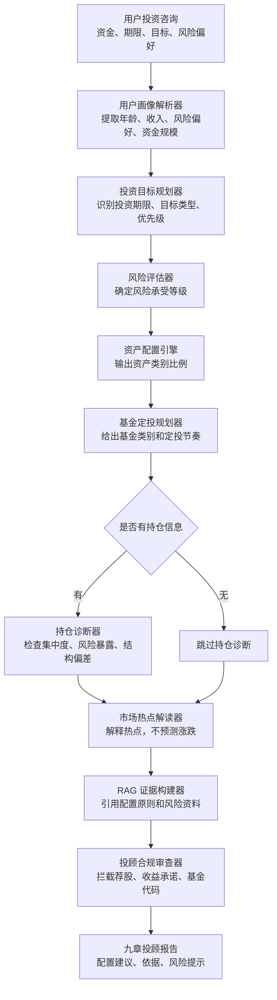
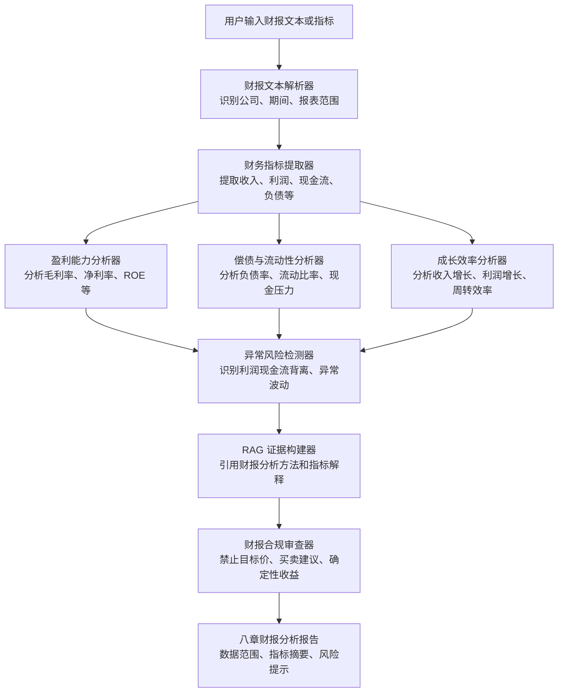
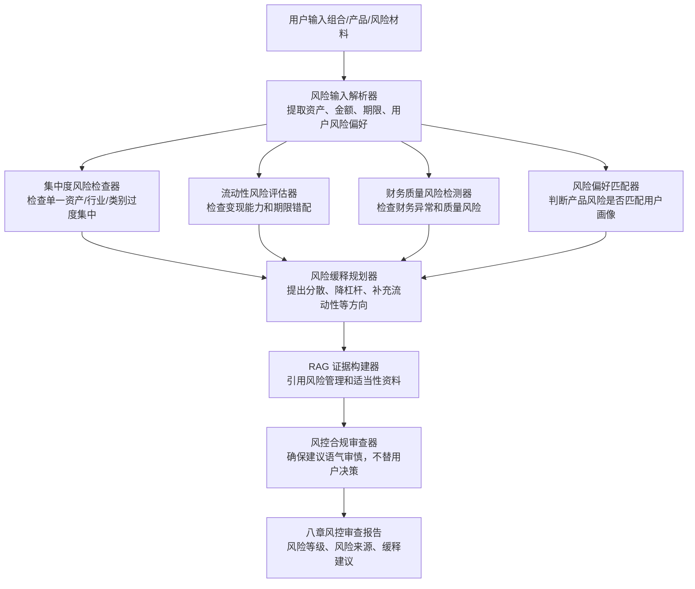
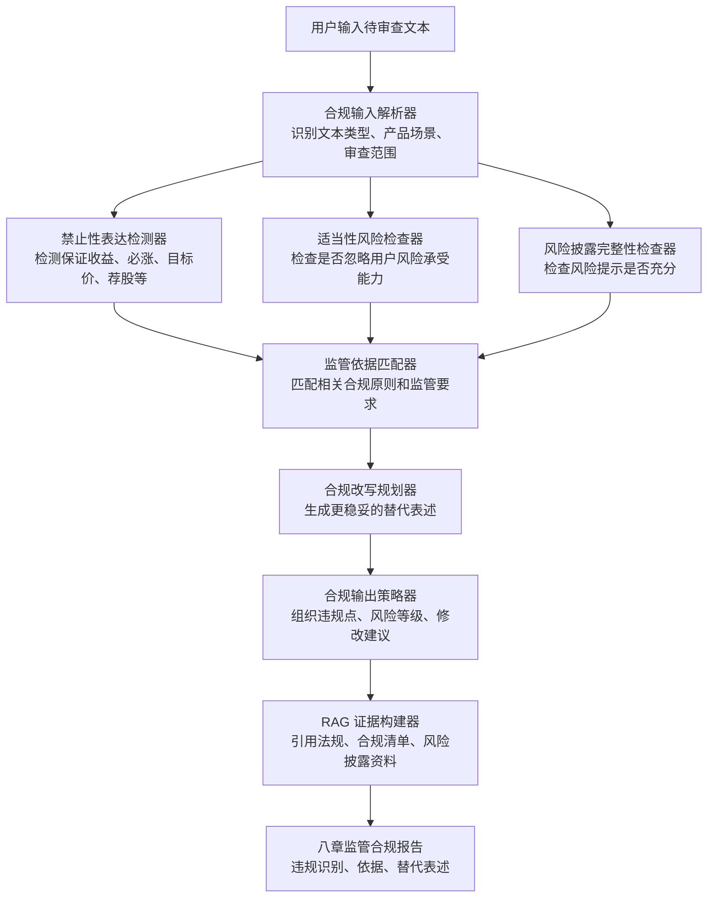
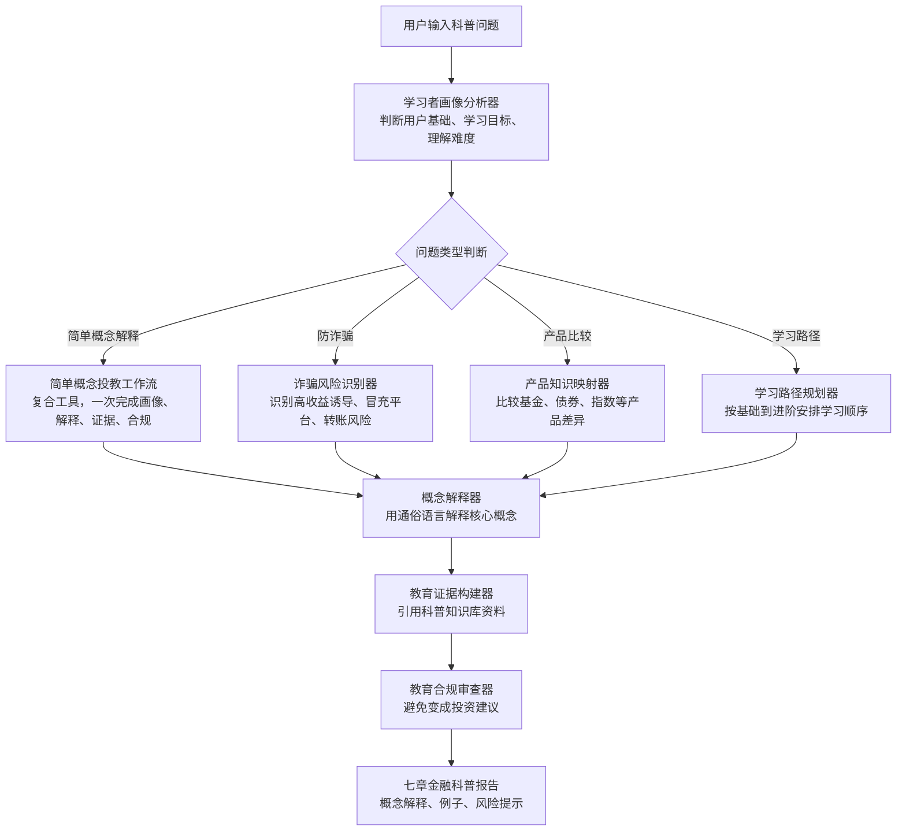

# 五个智能体流程图

本文档用于课程验收和视频讲解。每个智能体都采用 **DeepAgent 主脑 + 确定性工具 + RAG 证据 + 合规兜底** 的模式。DeepAgent 负责理解任务、编排工具和组织报告；关键金融判断尽量由规则工具、知识库证据和合规模块完成，降低大模型自由发挥带来的金融风险。

## 通用调用链

节点作用：

| 节点 | 作用 |
| --- | --- |
| 用户输入问题 | 用户用自然语言提出金融咨询、财报分析、风险审查、合规检查或科普问题。 |
| 统一 Agent Router | 根据关键词和优先级判断问题属于哪个业务场景。 |
| RAG Evidence Pack | 从 Chroma 知识库中检索依据，并预留 BM25、Hybrid、GraphRAG 扩展。 |
| DeepAgent 编排工具 | 负责调用确定性工具、整合工具结果、组织最终报告。 |
| 合规审查与风险提示 | 检查是否存在荐股、收益承诺、涨跌预测、替用户决策等风险表达。 |
| 前端展示 | 展示报告正文、证据来源、工具调用轨迹和运行状态。 |

## 智能体一：智能投顾智能体

业务目标：根据用户风险偏好、投资目标、资金规模，生成资产配置建议、基金定投方向、持仓诊断和市场热点解读。禁止推荐个股、具体基金代码和收益承诺。

节点作用：

| 节点 | 作用 |
| --- | --- |
| 用户画像解析器 | 把自然语言中的用户基本情况转成结构化画像。 |
| 投资目标规划器 | 判断用户是长期配置、教育金、养老、短期备用金等目标。 |
| 风险评估器 | 根据画像和目标判断保守、稳健、平衡、积极等风险等级。 |
| 资产配置引擎 | 只输出资产类别比例，不输出个股或具体基金产品。 |
| 基金定投规划器 | 给出基金类别、周期、金额区间等定投思路。 |
| 持仓诊断器 | 用户提供持仓时，检查结构是否过度集中或风险不匹配。 |
| 市场热点解读器 | 对市场热点做背景解释，不做涨跌预测。 |
| RAG 证据构建器 | 引用知识库中的资产配置、分散投资、风险匹配资料。 |
| 投顾合规审查器 | 保证最终输出符合投顾边界。 |

## 智能体二：财报分析智能体

业务目标：根据财报文本或财务指标，生成财务质量分析报告，覆盖盈利能力、偿债能力、成长效率、异常风险等，不输出买卖建议。

节点作用：

| 节点 | 作用 |
| --- | --- |
| 财报文本解析器 | 确认分析对象、报告期和输入材料范围。 |
| 财务指标提取器 | 抽取报表中的核心数值和关键指标。 |
| 盈利能力分析器 | 判断企业赚钱能力和利润质量。 |
| 偿债与流动性分析器 | 判断企业短期和长期偿债压力。 |
| 成长效率分析器 | 分析成长性和资源使用效率。 |
| 异常风险检测器 | 找出现金流异常、利润波动、负债压力等风险信号。 |
| RAG 证据构建器 | 提供财报分析原则、指标含义、风险解释依据。 |
| 财报合规审查器 | 确保报告是财务解读，不变成投资推荐。 |

## 智能体三：风控审查智能体

业务目标：对投资组合、客户画像或业务材料进行风险审查，识别集中度、流动性、信用、财务质量和风险偏好错配。

节点作用：

| 节点 | 作用 |
| --- | --- |
| 风险输入解析器 | 把用户输入转成可审查的资产、期限、金额和画像信息。 |
| 集中度风险检查器 | 识别单一资产、行业或策略占比过高的问题。 |
| 流动性风险评估器 | 判断资产能否及时变现，以及是否存在期限错配。 |
| 财务质量风险检测器 | 对企业或资产相关财务质量进行风险识别。 |
| 风险偏好匹配器 | 判断用户风险承受能力与产品风险是否匹配。 |
| 风险缓释规划器 | 给出降低风险的方向，不做强制投资决策。 |
| 风控合规审查器 | 保证输出是风险管理建议，而不是收益承诺或交易指令。 |

## 智能体四：监管合规智能体

业务目标：审查金融营销话术、投顾文本、产品宣传材料是否存在保证收益、诱导买入、目标价、风险披露不足等问题，并给出合规替代表述。

节点作用：

| 节点 | 作用 |
| --- | --- |
| 合规输入解析器 | 确认审查文本类型和适用场景。 |
| 禁止性表达检测器 | 识别保证收益、必涨、推荐买入、目标价等高风险表达。 |
| 适当性风险检查器 | 检查是否绕过投资者适当性要求。 |
| 风险披露完整性检查器 | 判断是否充分提示产品和市场风险。 |
| 监管依据匹配器 | 为违规判断提供法规或合规原则依据。 |
| 合规改写规划器 | 把高风险表达改写成审慎、合规的表达。 |
| 合规输出策略器 | 形成可读的审查报告和整改建议。 |

## 智能体五：金融科普智能体

业务目标：面向普通用户解释金融概念、防诈骗、产品区别和学习路径，降低理解门槛，不输出投资建议。

节点作用：

| 节点 | 作用 |
| --- | --- |
| 学习者画像分析器 | 判断用户是新手、普通投资者还是进阶学习者。 |
| 问题类型判断 | 将问题分为概念解释、防诈骗、产品比较或学习路径。 |
| 简单概念投教工作流 | 性能优化后的复合工具，减少 DeepAgent 重复调用。 |
| 诈骗风险识别器 | 识别常见金融诈骗信号和高风险话术。 |
| 产品知识映射器 | 比较不同金融产品的风险、收益来源和适用场景。 |
| 学习路径规划器 | 给出从基础概念到进阶知识的学习顺序。 |
| 概念解释器 | 把专业术语转换成普通用户能理解的表达。 |
| 教育证据构建器 | 引用金融科普知识库资料。 |
| 教育合规审查器 | 保证科普内容不变成具体投资建议。 |

## 录制视频时的讲解顺序建议

1. 先讲通用调用链：用户输入、Router、RAG、DeepAgent、合规、前端展示。
2. 再讲至少两个重点智能体，建议选择“智能投顾”和“监管合规”。
3. 如果时间充足，再快速说明另外三个智能体的业务边界。
4. 演示前端时重点展示：报告正文、证据来源、工具调用轨迹。
5. 最后强调合规边界：不荐股、不承诺收益、不预测涨跌、不替用户决策。
