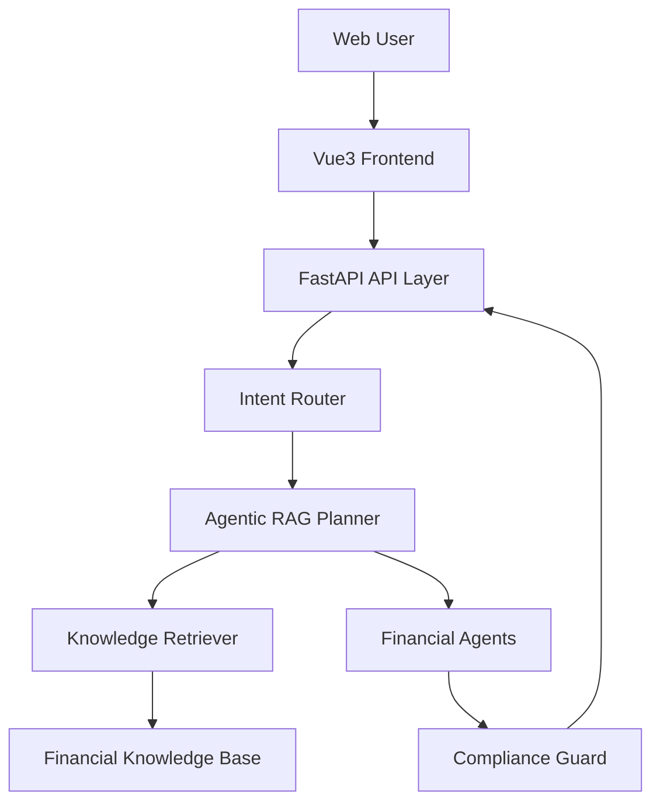

# Architecture Overview

## 1. 项目定位

本项目是一个 Agentic RAG 金融服务平台。系统不做普通聊天机器人，而是通过“意图识别 -> 任务拆解 -> 多轮检索 -> 专业智能体处理 -> 合规校验 -> 可视化展示”的闭环，为用户提供可追溯、合规、可解释的金融辅助服务。

## 2. 分层架构



## 3. 后端模块

- `app/api/routes/`: HTTP API 路由。
- `app/agents/`: 五大金融智能体和统一基类。
- `app/rag/`: 查询规划、文档加载、文本切分、嵌入向量、Chroma 存取、集合选择、检索接口。
- `app/services/`: 意图路由、合规校验、业务服务。
- `app/schemas/`: Pydantic 请求/响应模型。
- `app/core/`: 配置、日志、常量。
- `app/llm/`: LLM Provider 适配层、Prompt 模板。

### RAG 子模块

| Module | Location | Purpose |
|--------|----------|---------|
| DocumentLoader | `app/rag/document_loader.py` | Read .md/.txt/.json into uniform doc struct |
| TextSplitter | `app/rag/text_splitter.py` | Clean text, chunk with overlap |
| EmbeddingProvider | `app/rag/embedding_provider.py` | Cloud embedding via DashScope text-embedding-v4 |
| ChromaStore | `app/rag/chroma_store.py` | PersistentClient CRUD + semantic search |
| CollectionSelector | `app/rag/collection_selector.py` | Intent → collection whitelist (rule-based) |
| RagPlanner | `app/rag/planner.py` | Build retrieval query plans |
| KnowledgeRetriever | `app/rag/retriever.py` | Unified retrieval: Chroma-first, mock fallback |

## 3.1 技术栈决策

- LLM：使用 LangChain 的 DeepSeek 集成，模型名为 `deepseek-v4-flash`。只需要 DeepSeek API Key，不设置 Base URL。
- LLM Scope：先用于用户画像自然语言补全与最终报告润色；风险等级、资产配置比例、合规判断仍由规则模块负责。
- Vector Store：使用 Chroma PersistantClient，已接入 4 个业务域 collection。
- Embedding：云端 embedding 使用 DashScope text-embedding-v4（OpenAI 兼容接口）。
- Knowledge Metadata：MySQL 存结构化元数据（collection、document、chunk），Chroma 存向量和文本内容；双向通过 collection_name + chroma_id 关联。
- Hybrid Search：后续可能结合 BM25 做混合检索，当前阶段只在检索层预留扩展点。
- Git：开发过程不进行版本管理；最终测试完毕后再做整合。

## 4. 前端模块

- `src/views/`: 智能投顾、财报分析、风控审查、监管合规、金融科普页面。
- `src/components/`: 通用结果卡片、来源列表、风险提示、图表组件。
- `src/api/`: 后端 API 调用封装。
- `src/stores/`: 用户画像、会话历史、全局状态。

## 5. 核心业务流程

1. 用户输入问题或上传材料。
2. API 层校验请求。
3. Intent Router 判断业务类型。
4. RAG Planner 拆解检索任务。
5. Retriever 从知识库取回证据。
6. 对应 Agent 生成结构化答复。
7. Compliance Guard 做金融合规校验。
8. 前端展示结论、证据、风险提示。

## 6. 知识库架构

### 双层存储

- **MySQL**：存储 collections、documents、chunks 的结构化元数据（名称、来源、标签、状态等）。不含实际文本内容（summary 字段除外）。
- **Chroma**：存储文本向量和内容文本。按业务域分 collection，使用余弦相似度进行语义检索。

二者通过 `collection_name` + `chroma_id` 关联。

### Collection 设计

采用少量业务域 collection（非每文档一个，也非大杂烩）：

| Phase | Collection | 用途 |
|-------|-----------|------|
| 1 | `advisory_knowledge` | 投顾知识 |
| 1 | `compliance_knowledge` | 合规知识 |
| 1 | `education_knowledge` | 金融科普 |
| 1 | `risk_knowledge` | 风控知识 |
| 2 | `financial_report_knowledge` | 财报分析 |
| 2 | `market_knowledge` | 市场知识 |

### 检索策略

```
用户问题 -> IntentRouter -> CollectionSelector(白名单) -> ChromaStore.search() -> 排序结果
```

- CollectionSelector 是规则版，intent → collection 白名单。
- LLM 可建议集合但必须在白名单内。
- 不存在的 collection 静默跳过。

详见 `docs/knowledge_base.md`。

## 7. 合规设计

所有涉及投资建议的回答必须经过 `ComplianceGuard`：

- 拦截个股推荐、涨跌预测、收益承诺。
- 强制补充风险提示。
- 保留依据来源和置信度。
- 将 AI 定位为辅助工具，而非投资决策主体。
