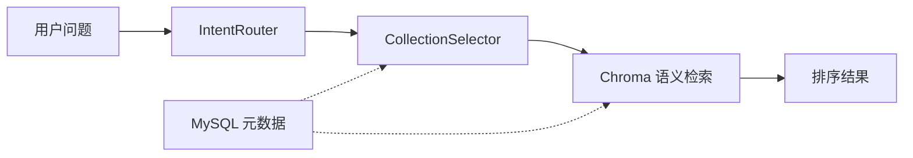

# Knowledge Base Design

## Overview

本系统的知识库采用 MySQL + Chroma 双层架构：

- **MySQL**：存储结构化元数据（collections、documents、chunks）。
- **Chroma**：存储向量嵌入和文本内容，提供语义相似度检索。

二者通过 `collection_name` + `chroma_id` 关联。MySQL 中不存实际文本内容（除 summary 字段外），Chroma 中不存关系型查询逻辑。

## Architecture



## Collection Design (Phase 1)

不采用"每个文档一个 collection"，也不采用"所有知识一个大杂烩"。

按业务域拆分少量 collection：

| Collection | 中文名 | 域 | 用途 |
|---|---|---|---|
| `advisory_knowledge` | 投顾知识库 | advisory | 资产配置、组合管理、定投策略 |
| `compliance_knowledge` | 合规知识库 | compliance | 监管法规、合规红线、风险提示范式 |
| `education_knowledge` | 金融科普知识库 | financial_education | 金融概念、产品基础知识 |
| `risk_knowledge` | 风控知识库 | risk_control | 风险评估模型、集中度/流动性管理 |

Phase 2 预留：

| Collection | 用途 |
|---|---|
| `financial_report_knowledge` | 财报分析、估值方法、会计准则 |
| `market_knowledge` | 宏观经济、行业分析、市场周期 |

## MySQL Tables

Schema: `backend/sql/knowledge_schema.sql`

### knowledge_collections

每个 Chroma collection 对应一条记录。

### knowledge_documents

每个入库文档一条记录。`collection_name` 指向其归属 collection。

### knowledge_chunks

每个文本块一条记录。`chroma_id` 是 Chroma 中的唯一 ID（格式 `{collection}_{content_hash}`），与向量库双向可查。

## Retrieval Strategy

### 当前阶段（Phase 1）

纯语义检索（余弦相似度）：

```
用户问题 -> IntentRouter(意图识别) -> CollectionSelector(白名单映射)
    -> ChromaStore.search(query, collections, top_k) -> 排序结果
```

### 服务层接入策略

`ConsultationService.__init__()` 在创建 `KnowledgeRetriever` 时采用保守的自动检测策略：

1. 检查 `settings.rag_enabled`（环境变量 `FIN_AGENT_RAG_ENABLED`），默认 `false`。
2. 如果启用，检查 Chroma 持久化目录是否存在（`FIN_AGENT_CHROMA_DIR`，默认 `data/chroma`）。
3. 检查 `DASHSCOPE_API_KEY` 是否已设置（embedding 查询向量化所需）。
4. 检查 Chroma 是否有至少一个 collection 有数据。
5. 上述任何一步失败 → 静默回退到 mock fallback，**绝不崩溃**。

这意味着：
- **测试环境**：默认 `FIN_AGENT_RAG_ENABLED` 不设置 → 走 mock fallback，无需任何 API key。
- **生产环境**：设置 `FIN_AGENT_RAG_ENABLED=true` + 预先入库 → 自动启用 Chroma 检索。
- **容错**：Chroma 目录丢失、API key 过期、依赖缺失等都不会影响主咨询流程。

### 环境变量参考

| 变量 | 默认值 | 说明 |
|---|---|---|
| `FIN_AGENT_RAG_ENABLED` | `false` | 是否启用 Chroma 检索 |
| `FIN_AGENT_CHROMA_DIR` | `data/chroma` | Chroma 持久化目录路径 |
| `DASHSCOPE_API_KEY` | （无） | DashScope API key（embedding 向量化必需） |
| `FIN_AGENT_EMBEDDING_MODEL` | `text-embedding-v4` | Embedding 模型名称 |

### 未来阶段

```
用户问题 -> IntentRouter -> CollectionSelector -> LLM 建议集合（白名单内）
    -> Chroma 语义检索 + BM25 混合排序 -> 重排序 -> 结果
```

LLM **可以**建议在哪个 collection 中检索，但**不能**自由指定任意 collection。最终由后端白名单校验。

### Collection Selection Rules

| Intent | Allowed Collections |
|---|---|
| `advisory` | advisory_knowledge, education_knowledge, compliance_knowledge |
| `compliance` | compliance_knowledge |
| `education` | education_knowledge |
| `risk_control` | risk_knowledge, compliance_knowledge |
| `financial_report` | financial_report_knowledge (Phase 2) |

不存在的 collection 静默跳过，不报错。

## Ingest Pipeline

```
data/knowledge_base/{domain}/*.md
    -> DocumentLoader (read + extract title/metadata)
    -> TextSplitter (clean + chunk with overlap)
    -> EmbeddingProvider (cloud embedding, text-embedding-v4)
    -> ChromaStore (delete old chunks by file_name → collection.upsert)
    -> MySQL (future: write metadata to knowledge_* tables)
```

重复入库时，系统会先按 `file_name` 删除同一源文件的旧 chunks，再写入新 chunks。这样文档内容修改后不会因为 `content_hash` 改变而残留旧向量。

## Chroma Chunk Metadata

每个 chunk 在 Chroma 中携带以下 metadata：

```json
{
    "document_id": "optional MySQL doc id",
    "collection_name": "advisory_knowledge",
    "source_type": "investment_knowledge",
    "title": "资产配置基础原则",
    "authority": "high",
    "url": null,
    "tags": "asset_allocation,beginner",
    "chunk_index": 0,
    "content_hash": "a1b2c3d4e5f6",
    "token_count": 623,
    "file_name": "asset_allocation_basics.md",
    "format": "md"
}
```

## Compliance Constraints

- 入库文档不得包含荐股、涨跌预测、收益承诺。
- LLM 不得决定 collection 白名单之外的集合。
- 所有 RAG 检索结果在给用户之前必须经 ComplianceGuard 校验。

## Real Ingest Steps

### 前置条件

设置 DashScope API Key：

```bash
# Windows PowerShell
$env:DASHSCOPE_API_KEY = "sk-..."

# Linux / macOS
export DASHSCOPE_API_KEY=sk-...
```

### 入库

```bash
# 使用项目指定 Python
D:\AI\soft\conda\envs\python3.11\python.exe backend/scripts/ingest_knowledge.py

# 或先 dry-run 确认
D:\AI\soft\conda\envs\python3.11\python.exe backend/scripts/ingest_knowledge.py --dry-run

# 单 collection 入库
D:\AI\soft\conda\envs\python3.11\python.exe backend/scripts/ingest_knowledge.py --collection advisory_knowledge
```

### 检查入库结果

```bash
# 列出所有 collections
D:\AI\soft\conda\envs\python3.11\python.exe backend/scripts/inspect_chroma.py

# 语义搜索
D:\AI\soft\conda\envs\python3.11\python.exe backend/scripts/inspect_chroma.py --query "保守型投资者如何配置资产" --collection advisory_knowledge

# 跨 collection 搜索
D:\AI\soft\conda\envs\python3.11\python.exe backend/scripts/inspect_chroma.py --query "什么是流动性风险"
```

### 启用服务层 Chroma 检索

```powershell
# Windows PowerShell
$env:FIN_AGENT_RAG_ENABLED = "true"
cd backend
uvicorn app.main:app --reload --port 8000
```

```bash
# Linux / macOS
export FIN_AGENT_RAG_ENABLED=true

# 启动服务
cd backend && uvicorn app.main:app --reload --port 8000
```

此后 `POST /api/consultations` 的 `sources` 字段将返回 Chroma 语义检索的真实结果，而非 mock 数据。

### 验证检索效果

```bash
curl -X POST http://localhost:8000/api/consultations \
  -H "Content-Type: application/json" \
  -d '{"question": "保守型投资者如何配置资产？"}'
```

返回的 `sources` 中应出现入库文档的标题（如"保守型资产配置原则"），`confidence` 为余弦相似度分值。

### 当前入库状态（2026-06-06）

已完成真实 embedding 入库，使用 DashScope `text-embedding-v4` 模型。

| Collection | 文档数 | Vector 数 | 领域 |
|---|---|---|---|
| `advisory_knowledge` | 5 | 9 | 资产配置、定投、分散化、长期投资、风险等级匹配 |
| `compliance_knowledge` | 4 | 6 | 合规红线、风险提示、投资者适当性、投资者保护 |
| `education_knowledge` | 4 | 8 | 基金概念、宽基指数、债券基础、净值与估值 |
| `risk_knowledge` | 5 | 8 | 集中度风险、流动性风险、权益波动、市场风险、信用风险 |
| **合计** | **18** | **31** | |

### 已验证的检索查询

| 查询 | Collection | Top-1 命中标题 | Score |
|---|---|---|---|
| "保守型投资者如何配置资产" | advisory | 资产配置基础原则 | 0.6362 |
| "投资建议有哪些合规边界" | compliance | 投资建议合规边界 | 0.7641 |
| "什么是基金" | education | 什么是基金 | 0.7457 |
| "什么是流动性风险" | risk | 流动性风险 | 0.7442 |
| "长期投资的复利效应" | advisory | 长期投资与复利效应 | 0.7760 |
| "投资者适当性管理" | compliance | 投资者适当性管理规定概要 | 0.7720 |
| "债券是什么" | education | 什么是债券 | 0.6750 |
| "信用风险和违约风险" | risk | 信用风险基础知识 | 0.7127 |

### 服务层端到端验证

`FIN_AGENT_RAG_ENABLED=true` 环境下，`ConsultationService` 成功注入 ChromaStore。4 条测试查询全部返回 Chroma 真实 source，标题与 mock store 无重叠。验证脚本：`backend/scripts/debug_chroma_service.py`。

项目总监验收时补充修复：`如何管理持仓集中度风险？` 应路由到 `risk_control`，并命中 `risk_knowledge` 中的 `持仓集中度风险`，而不是被 `advisory` 的 `持仓` 关键词吞掉。

## RAG Evaluation

### 概述

建立了可重复运行的离线 RAG 检索质量评估体系，对当前 Chroma 知识库做系统性的检索与路由质量评估。评估不涉及 LLM 生成质量。

### 评估资源

| 文件 | 用途 |
|------|------|
| `backend/eval/rag_eval_cases.json` | 40 个评估 case（advisory 10 / compliance 8 / education 8 / risk_control 8 / cross-domain 6） |
| `backend/scripts/evaluate_rag.py` | 评估脚本（dry-run 支持，JSON + Markdown 双输出） |
| `backend/eval/rag_eval_results.json` | 最新评估结果 JSON |
| `backend/eval/rag_eval_report.md` | 最新评估报告 Markdown |
| `backend/tests/test_rag_evaluation.py` | 评估体系单元测试（34 tests，不调用真实 API） |

### 评估流程

```
eval case → IntentRouter.route() → intent match?
         → CollectionSelector.get_collections() → collection coverage?
         → ChromaStore.search(query, collections, top_k) → top-1 / recall match?
         → 计算 metrics → JSON + Markdown 输出
```

### 运行方式

```bash
# Dry-run（仅校验 case 格式）
python backend/scripts/evaluate_rag.py --dry-run

# 真实评估（需要 DASHSCOPE_API_KEY + Chroma 数据）
python backend/scripts/evaluate_rag.py --top-k 5

# 自定义阈值
python backend/scripts/evaluate_rag.py --fail-under-top1 0.60 --fail-under-recall 0.80
```

### 最新评估结果（2026-06-06，修复后）

| Metric | Value | Threshold | Status |
|--------|-------|-----------|--------|
| Intent Accuracy | **95.00%** | ≥ 0.90 | ✅ PASS |
| Top-1 Accuracy | **90.00%** | ≥ 0.70 | ✅ PASS |
| Recall@5 | **100.00%** | ≥ 0.85 | ✅ PASS |
| MRR | **0.9425** | — | — |
| Collection Coverage | 90.00% | — | — |
| **Overall** | **✅ PASS** | | |

按 intent 分组：
| Intent | Top-1 Acc | Recall@5 | MRR |
|--------|-----------|----------|-----|
| advisory | 92.31% | 100.00% | 0.9615 |
| compliance | 100.00% | 100.00% | 1.0000 |
| education | 100.00% | 100.00% | 1.0000 |
| risk_control | 66.67% | 100.00% | 0.8000 |

按 difficulty 分组：
| Difficulty | Top-1 Acc | Recall@5 | MRR |
|------------|-----------|----------|-----|
| easy | 100.00% | 100.00% | 1.0000 |
| medium | 87.50% | 100.00% | 0.9375 |
| hard | 81.82% | 100.00% | 0.8818 |

### 关键发现

- **IntentRouter 关键词权重调整**是本轮最大改进：将 "基金"、"债券"、"股票" 等泛化词汇在 advisory 中的权重从 0.5-0.8 降至 0.2-0.3，同时为 compliance / risk_control / education 补充领域专属关键词。
- risk_control 的 Top-1 准确率（66.67%）相对较低，属于 embedding 排序质量问题，关键词路由无法解决。
- 所有 difficulty 级别的 Recall@5 均达 100%，说明知识库覆盖面足以支撑当前 40 个 case 的检索需求。

## Cross-domain Retrieval

### 概述

用户问题往往需要跨多个知识域检索。例如"定投基金有风险吗？合规吗？"需要同时查投顾知识（advisory）、风控知识（risk）和合规知识（compliance）。

### Primary + Secondary Intent 架构

```
用户问题 → IntentRouter → primary_intent (单一)
         → SecondaryIntentDetector → [secondary_intents...]
         → CollectionSelector.get_collections_for_intents(primary, secondary)
         → 合并 collection 列表 → Chroma 跨域检索
```

### SecondaryIntentDetector

纯规则关键词检测，不调用 LLM。输入 query + primary_intent，输出排除 primary 后的 secondary intent 列表。

**设计原则：**
- 不调用 LLM（确定性、低成本、可审计）
- 不返回 primary_intent（避免重复）
- 去重，稳定排序
- 覆盖 5 个 intent 类别，各有独立关键词表

### Collection 合并策略

1. primary intent 的 collections 放最前面（保持优先级）。
2. 按 secondary intents 顺序追加 collections。
3. 去重（保留首次出现顺序）。
4. 如传入 ChromaStore，过滤不存在或无数据的 collection。
5. `financial_report_knowledge` 当前不存在时静默跳过。

### 为什么不让 LLM 自由选 collection？

- LLM 可能建议不在白名单内的 collection，带来合规风险。
- 规则版 CollectionSelector 提供确定性、可审计的 collection 映射。
- 未来可允许 LLM **建议**额外 collection，但后端必须在白名单内校验。

### 最新评估结果（含跨域，2026-06-06）

| Metric | Before (single-intent) | After (multi-intent) | Change |
|--------|----------------------|---------------------|--------|
| Collection Coverage | 90.00% | **100.00%** | +10pp |
| Top-1 Accuracy | 90.00% | 85.00% | -5pp |
| Recall@5 | 100.00% | 97.50% | -2.5pp |
| MRR | 0.9425 | 0.9083 | -0.034 |

Collection Coverage 提升至 100%，所有 XDM cases 现在都能覆盖预期的知识域。Top-1 和 Recall 的轻微下降是因为搜索更多 collection 带来更多候选噪声，但仍在阈值内（Top-1 ≥ 80%, Recall ≥ 95%）。

## Evidence Injection

### 概述

RAG 检索到的 Source 列表经过 `EvidencePack` 转换后注入智能投顾回答，使回答"有依据、可追溯、合规"。不做 LLM 生成 evidence，不编造文档内容。

### Source → EvidencePack 转换

```
Sources → build_evidence_pack(sources, max_items=6) → EvidencePack
  ├── items: list[EvidenceItem]
  ├── by_type: {advisory: [...], risk: [...], compliance: [...], education: [...]}
  ├── has_advisory / has_risk / has_compliance / has_education: bool
  ├── top_titles: list[str]
  └── low_confidence: bool
```

`EvidenceItem` 字段：
| 字段 | 说明 |
|------|------|
| title | 来源文档标题 |
| evidence_type | advisory / risk / compliance / education / unknown |
| summary | 短摘要如《资产配置基础原则》（投顾知识） |
| usage_hint | 如"可作为资产配置/定投建议的依据参考" |
| confidence | 检索置信度分数 |

### source_type → evidence_type 映射

| source_type | evidence_type |
|-------------|--------------|
| investment_knowledge, asset_allocation | advisory |
| risk_models, risk_* | risk |
| regulations, compliance_*, legal_documents | compliance |
| financial_education, glossary, tutorials | education |
| 其他 | unknown |

### Low Confidence 降级

当 sources 为空或 top-1 confidence < 0.45 时 `low_confidence=True`：
- 回答开头显示"当前参考资料置信度有限，以下建议仅作通用框架"
- 不给过细配置建议

### 注入位置（智能投顾九个章节）

| 章节 | Evidence 注入方式 |
|------|------------------|
| 三、风险评估结果 | 内联风险 evidence |
| 四、资产配置建议 | 内联投顾 evidence |
| 五、基金定投规划 | 内联投顾 evidence |
| 六、持仓诊断 | 内联风险 evidence |
| 八、参考依据与适用边界 | 完整 evidence 列表（含 usage_hint） |
| 九、风险提示 | 合规 evidence 强化 |

### 关键文件

- `backend/app/rag/evidence.py` — EvidenceItem, EvidencePack, build_evidence_pack
- `backend/app/agents/investment_advisor.py` — evidence 注入 _build_answer
- `backend/scripts/debug_investment_advisor_evidence.py` — 验证脚本

## MySQL Metadata Sync

### 概述

MySQL 存储 collection / document / chunk 的结构化元数据，Chroma 存储向量与文本。二者通过 `collection_name` + `chroma_id` 双向可查。

### 环境变量

| 变量 | 默认值 | 说明 |
|------|--------|------|
| `FIN_AGENT_MYSQL_ENABLED` | `false` | 是否启用 MySQL 元数据同步 |
| `MYSQL_HOST` | `127.0.0.1` | MySQL 主机地址 |
| `MYSQL_PORT` | `3306` | MySQL 端口 |
| `MYSQL_USER` | `root` | MySQL 用户 |
| `MYSQL_PASSWORD` | （无） | MySQL 密码（必须通过环境变量提供） |
| `MYSQL_DATABASE` | `fin_agent_knowledge` | 目标数据库名 |

### 运行方式

```powershell
# 设置环境变量（不写入任何文件）
$env:FIN_AGENT_MYSQL_ENABLED = "true"
$env:MYSQL_PASSWORD = "..."
# 其他变量使用默认值即可

# 1. 初始化 schema
python backend/scripts/init_mysql_schema.py

# 2. 同步 Chroma 元数据到 MySQL
python backend/scripts/ingest_knowledge.py --sync-mysql

# 3. 检查 MySQL 元数据并与 Chroma 对比
python backend/scripts/inspect_knowledge_metadata.py --compare-chroma
```

### MySQL 与 Chroma 分工

| 存储层 | 存储内容 | 用途 |
|--------|----------|------|
| MySQL | collection/doc/chunk 元数据、审计字段、状态管理 | 结构化查询、生命周期管理、审计追踪 |
| Chroma | 文本向量、完整 chunk 文本 | 语义检索、相似度排序 |

MySQL **不存**完整 chunk 内容，只存 `chunk_index`、`chroma_id`、`content_hash`、`token_count` 和 `metadata_json`。

同步写入时，`ingest_knowledge.py --sync-mysql` 会在 Chroma upsert 成功后调用 `KnowledgeMetadataStore.upsert_document_with_chunks()`，将 document 元数据与其 chunks 替换操作放在同一 MySQL 事务内；任一步失败都会 rollback 并返回非 0。

### 当前同步状态（2026-06-06）

| Collection | MySQL docs | MySQL chunks | Chroma vectors | Match |
|------------|-----------|-------------|----------------|-------|
| advisory_knowledge | 5 | 9 | 9 | ✅ |
| compliance_knowledge | 4 | 6 | 6 | ✅ |
| education_knowledge | 4 | 8 | 8 | ✅ |
| risk_knowledge | 5 | 8 | 8 | ✅ |
| **Total** | **18** | **31** | **31** | ✅ |

## References

- `backend/app/rag/collection_selector.py` — 白名单映射
- `backend/app/rag/chroma_store.py` — Chroma 封装
- `backend/app/rag/retriever.py` — 统一检索入口
- `backend/app/rag/metadata_store.py` — MySQL 元数据存储
- `backend/app/services/consultation_service.py` — 服务层 Chroma 接入
- `backend/app/core/config.py` — RAG / MySQL 配置项
- `backend/sql/knowledge_schema.sql` — MySQL DDL
- `backend/scripts/init_mysql_schema.py` — Schema 初始化脚本
- `backend/scripts/inspect_knowledge_metadata.py` — MySQL 检查与 Chroma 对比
- `backend/eval/rag_eval_report.md` — 最新评估报告
- `backend/scripts/evaluate_rag.py` — 评估脚本
